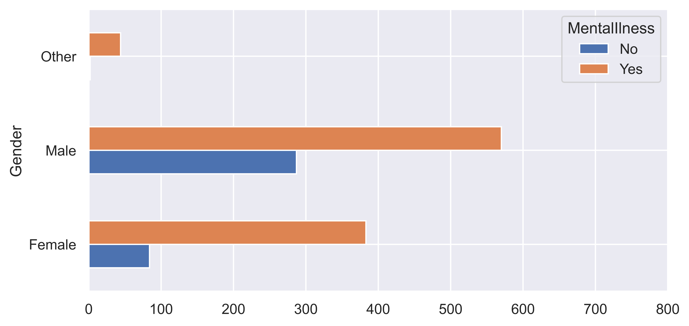
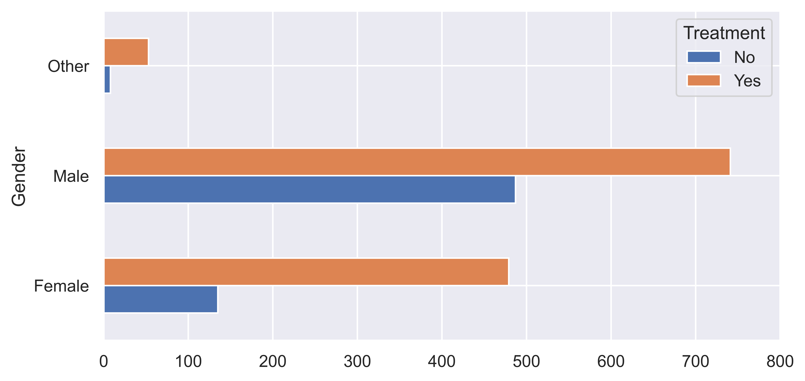
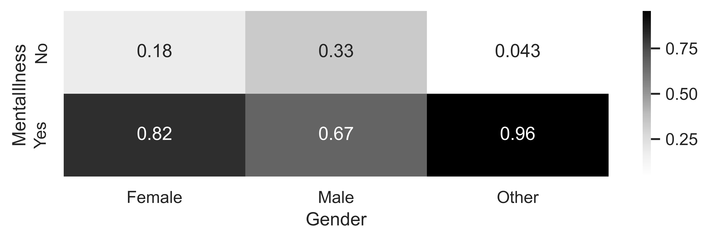
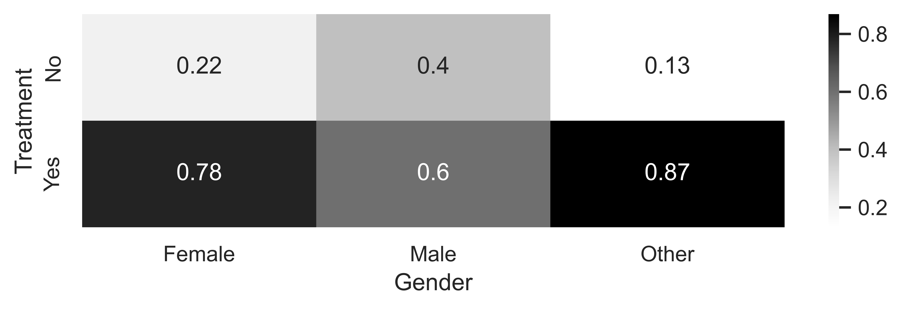
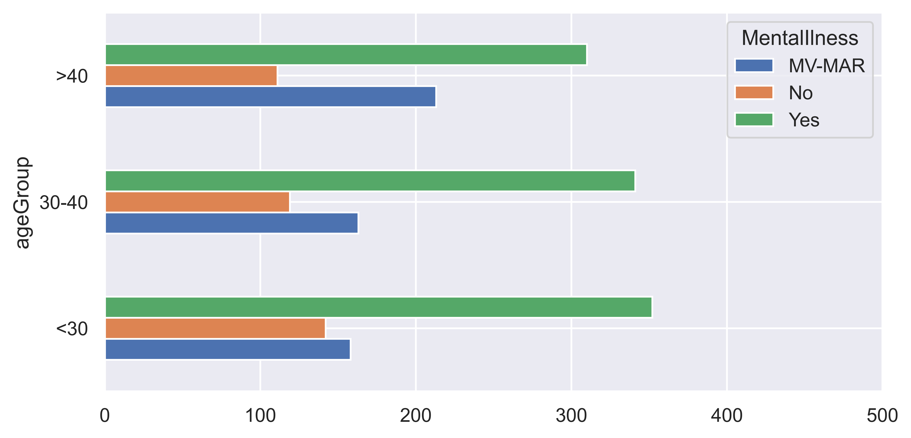
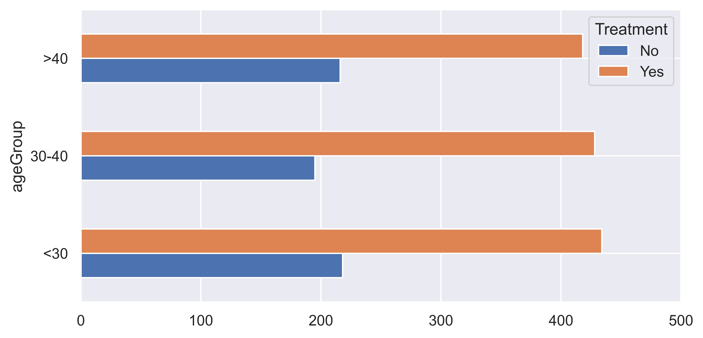
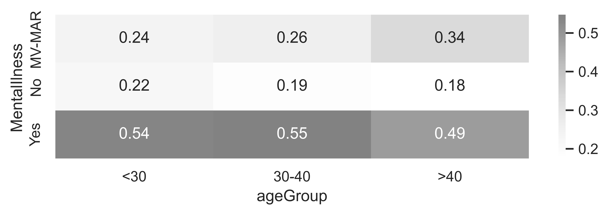
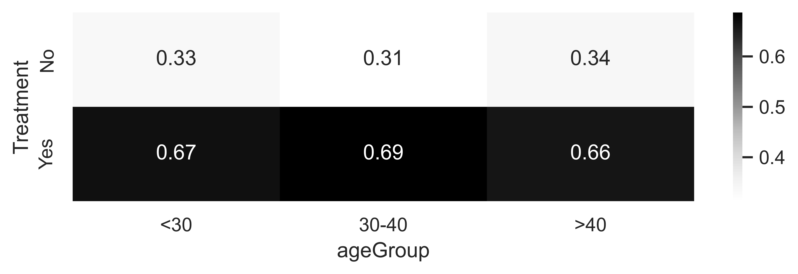
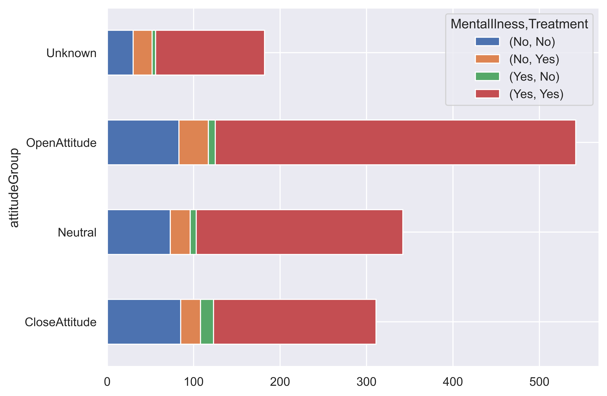

# Mental Health in Tech Coompanies - Anlysis


<figcaption class="" data-selectable-paragraph="">Unsplash- Marcel Strauß</figcaption>

## Project Overview

Mental health disorders such as anxiety and depression are inherently detrimental to people's well-being, lifestyles, and ability to be productive in their work. According to Mental Health America, over 44 million adults in the US have a mental health condition. The mental health of employees in the tech industry is of great concern due to the competitive environments often found within and among these companies. Some employees at these companies are forced to work overtime simply to keep their jobs. Managers of these types of companies have good reason to desire improved mental health for their employees because healthy minds are productive ones and distracted minds are not. Managers and leaders of tech and non-tech companies must make difficult decisions regarding whether or not to invest in the mental health of their employees and, if so, to what degree. There is plenty of evidence that poor mental health can have a negative impact on workers' well-being and productivity. Every company has a finite amount of funds that it can invest in the physical health of its employees, let alone mental health. Knowing where to allocate resources is of great importance.

This analysis is intended for the managers and the leaders of tech companies who are in charge of making decisions that can impact the mental health of their employees.

## Data Source

In this project, I’m going to use data collected by Open Sourcing Mental Illness (OSMI) (https://osmihelp.org/). OSMI conducts yearly surveys that "aim to measure attitudes towards mental health in the tech workplace and examine the frequency of mental health disorders among tech workers." These surveys are accessible to the public for participation and can be found at https://osmihelp.org/research.

**Note:** the datasets used in this analysis are from year 2016 to 2020.


## File Description

~~~~~
Mental Health in Tech

    |   Mental Health Survey Analysis.ipynb
    |   README.md
    |   
    +---data
    |       2014.csv
    |       2016.csv
    |       2017.csv
    |       2018.csv
    |       2019.csv
    |       2020.csv
    |       
    \---visuals
            AQ1.png
            AQ1_1.png
            AQ1_2.png
            AQ2_1.png
            AQ2_2.png
            AQ2_Heatmap_1.png
            AQ2_Heatmap_2.png
            AQ3.png
            AQ4.png

~~~~~


## Analysis

Specifically for this analysis, I addressed the following **Analytic Questions**:  
  1.	**AQ1**: Is there a significant difference between the mental health of employees across the attribute of gender?  
  2.	**AQ2**: Is there a significant difference between the mental health of employees across the attribute of age?   
  3.	**AQ3**: Do more supportive companies have healthier employees mentally?  
  4.	**AQ4**: Does the attitude of individuals toward mental health influence their mental health and their seeking of treatments?  


### AQ1 – Is there a significant difference between the mental health of employees across the attribute of gender?  




The preceding barplot shows that the mental health of tech employees does change across the **Gender** attribute.
* The ratio of <u>not having a mental illness</u> compared to <u>having a mental illness</u> is higher for *Male* than *Female*.
* The ratio of <u>"never having sought professional mental health help"</u> compared to <u>"having south professional mental health treatment"</u> is higher among *Male* than *Female*.

These observations suggest that there is a population of male employees in tech that are not aware of their mental health and have never sought professional help. Based on these observations, it should be recommended to target male employees for mental health awareness.

Another important observation from the preceding figure is that there seem to be many more mental health concerns for the individuals who have not chosen Male or Female for their gender. However, the preceding figure does not show what the difference is because this segment of the population has much smaller data objects than Male and Female. Therefore, to tease out the portion of these individuals with mental health concerns and compare them with the other two subpopulations, the following two heat maps were created:





* From the preceding heatmaps visualisations, 96% of the subpopulation that did not identify as *Male* or *Female* have a mental health problem. However, we can see that higher proportion of this population, similar to the population of *Female*, has south mental health treatment.

### AQ2 – Is there a significant difference between the mental health of employees across the attribute of age?   

To answer this question, I visualized the interaction between three attributes: **Age**, **Mental Illness**, and **Treatment**. 







The preceding figures show the bar charts and heatmap that visualize the relationships that we are interested in investigating. We can see that there seem to be some patterns in the data; however, they are not as prounounced as they were under AQ1. So before discussing these patterns, I tested whether these patterns are statistically significant. Since we are dealing with categorical variable, I used `chi-square test` of association for this purpose. The below table shows the statistical significance of the tests.


| | MentallIllness|Treatment|
|:---------:|:---------:|:---------:|
|ageGroup | 0.002 | 0.549|

* The first p-value (0.0022) indicates that there is a significant association between *ageGroup* and *MentalIlness*

* The second p-value (0.5497) indicates that there is no significant association between *Treatment* and *ageGroup*

From these two information, we can conclude that while age does have an impact on mental health concerns, it does not impact the behavior of individuals in seeking treatment.

From the barchart, we can also observe that as the Age increases, the answer *No* to the question *Have you ever been diagnosed with a mental health disorder?* also increasses. Surprisingly, the answer *Yes* to the same question also increases.
This is surprising because we would expect these two answers to counteract with one another.The reason for this surprising observation is also shown in this bar chart; as the age increases, the number of individuals who have not answered the question has also increased. This could be because older individuals do not have as much trust in the confidentiality of the data collection.

The conclusion that is drawn from this observation is that older tech employees may need to build more trust for them to open up about their mental health concerns than younger employees.


### AQ3 – do more supportive companies have mentally healthier employees?

To Answer this question, I had to create a new attribute called `PerceivedSupportScore`. This score reflects whether the employer supports employees regarding their mental health conditions. Negative score indicates lack of support, positive score indicates present support in the organization. Please see the notebook to understand how this score was calculated.


Studying the patterns shown in the preceding figure, we realize that `perceivedSupportScore` influences the employee's behavior in seeking professional help for mental health concerns. The number of respondents that have answered *Yes* to both *Have you ever been diagnosed with a mental health disorder?* and *Have you ever sought treatment for a mental health disorder from a mental health professional?* questions is significantly higher in the Supportive category. Likewise, the number of respondents that have answered *No* to both questions is significantly lower in the Supportive category.

Based on these observations, we can recommend investing in creating trust and employees' perception of support in tech companies.


### AQ4 – does the attitude of individuals toward mental health influence their mental health and their seeking of treatments?

Similar to AQ3, to answer this question, `AttitudeScore` will be a column that indicates the participant's attitude toward sharing mental health issues. Please refer to the notebook to read the explanation of how the `AttitudeScore` was created.




The preceding visualization provides an answer for AQ4. There seems to be a meaningful improvement in employees seeking treatment if they have an open attitude toward sharing mental health issues. These observations suggest that tech companies should see the education of employees in their attitude toward mental health as a sensible investment option.


## Tools and Packages
---
```sh
# Packages
- Matplotlib
- Numpy
- Pandas
- re
- Seaborn
- scipy.stats
- difflib
- SequenceMatcher
```

```
# Data Cleaning Steps

- Integrating data from different data sources
    - Used `SequenceMatcher` from the `difflib` module to perform data integration. `SequenceMatcher` was used to find sruvey questions that are similar between the different datasets.

- Removing HTML Tags
    - `re` was used to remove HTML tags from survey questions

- Data transformation
    - Created new attributes from the available attributes to help perform the analysis.

- Diagnosing and handling missing values
    - Used `ttest_ind` from `scipy.stats` to diagnose the type of missing values present in numerical attributes.
    - Used `chi2_contingency` from `scipy.stats` to diagnose the type of missing values present in categorical attributes.
```
